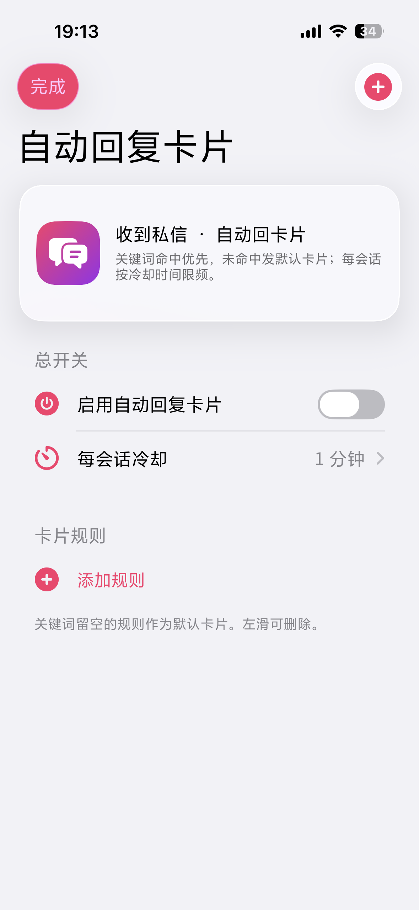
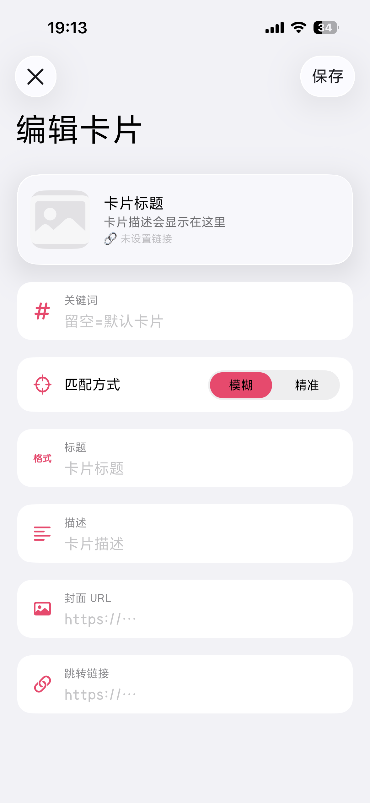

**한국어** · [中文](README.zh.md)

# CardAutoReply — 더우인(抖音) DM 「자동 응답 카드」

**상대방에게 DM을 받으면 규칙에 따라 링크 카드를 자동으로 회신합니다.** 전부 더우인 **네이티브 클래스**로 송수신합니다.

<p align="center">
  
  &nbsp;&nbsp;
  
</p>

- 키워드 우선 매칭, 미매칭 시 「기본 카드」(키워드 비움 규칙) 사용, **정확 / 부분(모호)** 매칭 지원
- 여러 규칙, 각각 개별 설정: 키워드 / 커버 URL / 제목 / 설명 / 이동 링크
- **대화별 N분 쿨다운** — 도배 방지 / 리스크 컨트롤 회피
- **전역 트리거**: TIMX SDK 전역 싱글턴 `TIMXOThirdPartyConversationNotifier` 후킹, 어느 대화에 메시지가 와도 채팅 화면을 열지 않고 자동 응답
- 전송은 더우인 IM SDK 사용: `IESIMSendMessageModel`(messageType=26 링크 카드) + `IESIMMessageSender`
- iOS 26 리퀴드 글래스 설정 화면, 카드 편집 시 실시간 미리보기

> ⚠️ **DouyinHelper와 동시 설치 불가** (동일 프로세스 훅 충돌). 본 모듈은 송수신과 설정 진입점을 자체 내장하여 독립 실행됩니다.

## 파일

| 파일 | 역할 |
|---|---|
| `Tweak.xm` | DM 수신 훅 + 매칭/쿨다운/전송 로직, `AHRStore` 저장 |
| `Editor.mm` | 설정 화면 `AHRCardAutoReplyEditor` (`+present` 로 호출) |
| `PanelIntegration.xm` | 채팅 「+」 패널(`AWEIMPlusPanelView`) 그리드 항목으로 진입점 추가 |
| `Makefile` / `control` / `CardAutoReply.plist` | Theos 빌드 (`Aweme` 프로세스 주입, `AWEIMMessageListDataComponent` 클래스로 필터) |

## 빌드

[Theos](https://theos.dev) 필요. **동봉된 `build.sh` 사용** (`THEOS` 와 `DEVELOPER_DIR` 자동 설정 — 후자는 Xcode 16/26 의 `xcodebuild -sdk '' -find make` 크래시 우회용):

```bash
cd CardAutoReply
./build.sh                  # 컴파일만
./build.sh package          # rootful .deb 빌드 -> ./packages/
./build.sh package rootless # rootless .deb (TrollStore/Dopamine 등)
./build.sh clean
```

> `make` 를 직접 쓰려면 현재 셸 환경에 두 변수를 먼저 설정 (Makefile 에 써도 무효):
> `export THEOS=~/theos DEVELOPER_DIR=/Library/Developer/CommandLineTools`

arm64 + arm64e 컴파일/패키징 검증됨. 기기 설치: `./packages/*.deb` 를 Filza / `dpkg -i` / 패키지 매니저로 설치.

## 사용법

1. 아무 DM 대화에 들어가 입력창의 **「+」** 패널을 펼치고 그리드에서 **「자동 응답 카드」** 를 눌러 설정 화면 진입
2. 「자동 응답 카드 사용」 켜기
3. 「+」 로 규칙 추가, 키워드와 카드 내용 입력; **키워드 비움 = 기본 카드**
4. 「대화별 쿨다운(분)」 설정, 기본 5
5. 상대가 규칙에 매칭되는 메시지를 보내면 자동으로 카드 회신

## 설명 / 제약

- **전역 트리거**: TIMX SDK 전역 싱글턴 `TIMXOThirdPartyConversationNotifier -didInsertNewMessages:belongingConversation:` 후킹, 모든 대화의 새 메시지에 반응 (채팅 화면 열 필요 없음).
- **iOS 제약**: 탈옥 트윅은 더우인 프로세스 내부에 기생합니다. 더우인이 시스템에 의해 **suspend / 종료**되면 트윅도 실행되지 않아 자동 응답이 불가합니다. 더우인이 **실행 중**(포그라운드 또는 짧은 백그라운드)일 때만 동작합니다.
- 카드의 커버 URL / 링크는 공개 https 직링크 권장.
- 쿨다운 기록은 `NSUserDefaults`(`AHRCardAutoReply.lastSend`)에 저장, 재시작 후에도 유지.

## 작성자 / 연락처

- 작성자: **H7ang0**
- 이메일: **H7ang0@gmail.com**
- 라이선스: MIT ([LICENSE](LICENSE) 참고)
